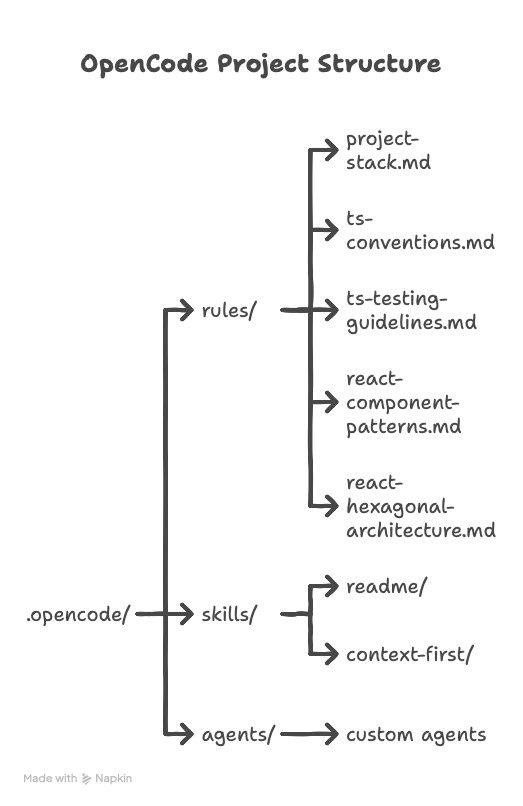

- [OpenCode Workflow](#opencode-workflow)
  - [Features](#features)
  - [Project Structure](#project-structure)
  - [Tech Stack Coverage](#tech-stack-coverage)
  - [Quick Start with Bootstrap](#quick-start-with-bootstrap)
    - [Usage](#usage)
    - [Interactive Walkthrough](#interactive-walkthrough)
    - [What Gets Created](#what-gets-created)
    - [Rule Filtering](#rule-filtering)
    - [Symlinks vs Copy](#symlinks-vs-copy)
  - [Prerequisites](#prerequisites)
  - [Manual Installation](#manual-installation)
  - [Available Skills](#available-skills)

# OpenCode Workflow

Configuration and conventions to optimize OpenCode usage on TypeScript/React projects.

## Features

- Ready-to-use OpenCode configuration rules
- Strict TypeScript conventions with recommended patterns
- Hexagonal architecture for React applications
- Testing guidelines with Testing Library
- Custom skills (readme, context-first)
- Bootstrap script for easy setup (symlinks or copy)

## Project Structure

<div align="center">
  
</div><br />

```
.opencode/
├── rules/
│   ├── project-stack.md              # Supported tech stack
│   ├── ts-conventions.md             # TypeScript conventions
│   ├── ts-testing-guidelines.md      # Testing guidelines
│   ├── react-component-patterns.md   # React component patterns
│   └── react-hexagonal-architecture.md # Hexagonal architecture
├── skills/
│   ├── readme/            # README generation
│   └── context-first/     # Context-first implementation strategy
└── agents/                # Custom agents (optional)

AGENTS.md                  # Master rules for all agents
opencode.json              # OpenCode configuration
bootstrap.mjs              # Node.js setup script
```

## Tech Stack Coverage

| Category   | Technologies                                              |
| ---------- | --------------------------------------------------------- |
| Frontend   | React, Next.js, Vite, TypeScript, Tailwind CSS, ShadCN UI |
| Backend    | Node.js, Fastify, Express, NestJS, Supabase               |
| State      | Zustand, TanStack Query, React Context                    |
| Testing    | Vitest, Jest, React Testing Library                       |
| Tooling    | ESLint, Prettier, pnpm, Docker                            |
| Middleware | Auth0, Stripe                                             |

## Quick Start with Bootstrap

The bootstrap script automates the setup process by creating symlinks (or copying files) from this repository to your target project.

### Usage

```bash
# Install dependencies (first time only)
npm install

# Run the bootstrap script with target path
npm run bootstrap ../my-project

# Or directly with node
node bootstrap.mjs ~/projects/my-app
```

### Interactive Walkthrough

The script prompts you to:

1. **Select technologies**: Choose React and/or TypeScript to filter relevant rules
2. **Choose mode**: Symlinks (recommended) or copy files

```
OpenCode Workflow → /Users/you/projects/my-app

? Select technologies
  [ ] React - Components, hooks, patterns
  [x] TypeScript - Conventions, testing

? Use symlinks? (No = copy files) Yes

Summary
  Rules:         3 linked
  Skills:        2 linked
  Agents:        0 linked
  AGENTS.md:     linked
  opencode.json: copied

Done
```

### What Gets Created

| Path                | Description                            |
| ------------------- | -------------------------------------- |
| `.opencode/rules/`  | Rules matching selected technologies   |
| `.opencode/skills/` | All available skills                   |
| `.opencode/agents/` | Custom agents (if any)                 |
| `AGENTS.md`         | Master rules file                      |
| `opencode.json`     | OpenCode configuration (always copied) |

### Rule Filtering

| Selection  | Rules Included                                |
| ---------- | --------------------------------------------- |
| React      | `react-*.md` + `project-stack.md`             |
| TypeScript | `ts-*.md` + `project-stack.md`                |
| Both       | `react-*.md` + `ts-*.md` + `project-stack.md` |

### Symlinks vs Copy

| Mode     | Pros                                | Cons                          |
| -------- | ----------------------------------- | ----------------------------- |
| Symlinks | Centralized updates, no duplication | Requires source repo presence |
| Copy     | Self-contained, portable            | Manual updates needed         |

## Prerequisites

- Node.js >= 18
- npm or pnpm

## Manual Installation

If you prefer not to use symlinks:

1. Copy the `.opencode/` folder to the root of your project
2. Copy `AGENTS.md` to your project root
3. Copy `opencode.json` to your project root
4. Adapt `rules/project-stack.md` according to your stack

## Available Skills

| Skill            | Description                                          |
| ---------------- | ---------------------------------------------------- |
| `/readme`        | Generates or updates the project README.md           |
| `/context-first` | Context-first implementation based on provided files |
