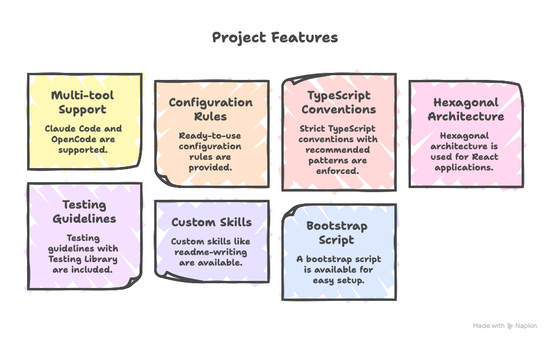

# AI Workflow

Configuration and conventions to optimize AI coding assistants on TypeScript/React projects.

## Features



## Tech Stack Coverage

| Category | Technologies                                              |
| -------- | --------------------------------------------------------- |
| Frontend | React, Next.js, Vite, TypeScript, Tailwind CSS, ShadCN UI |
| Backend  | Node.js, Fastify, Express, NestJS, Supabase               |
| State    | Zustand, TanStack Query, React Context                    |
| Testing  | Vitest, Jest, React Testing Library                       |
| Tooling  | ESLint, Prettier, pnpm, Docker                            |

## Getting Started

### Prerequisites

- Node.js >= 18
- pnpm or npm

### Installation

```bash
pnpm install
```

### Usage

```bash
# Run the bootstrap script with target path
pnpm run bootstrap ../my-project

# Or directly with node
node bootstrap.mjs ~/projects/my-app
```

### Interactive Walkthrough

The script prompts you to:

1. **Select technologies**: Choose React and/or TypeScript to filter relevant rules
2. **Choose mode**: Symlinks (recommended) or copy files
3. **Gitignore handling**: Add entries to ignore or create exceptions
4. **Select target tool**: Claude Code or OpenCode

```
OpenCode Workflow → /Users/you/projects/my-app

? Select technologies
  [ ] React - Components, hooks, patterns
  [x] TypeScript - Conventions, testing

? Use symlinks? (No = copy files) Yes

? Gitignore handling? Add to .gitignore

? Select target tool Claude Code

Summary
  Rules:         3 linked
  Skills:        3 linked
  Agents:        0 linked
  CLAUDE.md:     linked
  .mcp.json:     copied
  .gitignore:    entries added

Done
```

## Project Structure

```
config/
├── rules/
│   ├── ts-conventions.md              # TypeScript conventions
│   ├── react-conventions.md           # React component patterns
│   └── react-hexagonal-architecture.md # Hexagonal architecture
├── skills/
│   ├── readme-writing/     # README generation
│   ├── implement-within/   # Context-first implementation strategy
│   └── ts-test-writing/    # Testing guidelines
├── agents/                 # Custom agents (optional)
├── AGENTS.md               # Master rules for all agents
├── claudecode.settings.json # Claude Code configuration
└── opencode.settings.json   # OpenCode configuration

bootstrap.mjs               # Node.js setup script
```

## Supported Tools

| Tool        | Config File     | Root File   | Directory    |
| ----------- | --------------- | ----------- | ------------ |
| Claude Code | `.mcp.json`     | `CLAUDE.md` | `.claude/`   |
| OpenCode    | `opencode.json` | `AGENTS.md` | `.opencode/` |

## Rule Filtering

| Selection  | Rules Included           |
| ---------- | ------------------------ |
| React      | `react-*.md`             |
| TypeScript | `ts-*.md`                |
| Both       | `react-*.md` + `ts-*.md` |

## Symlinks vs Copy

| Mode     | Pros                                | Cons                          |
| -------- | ----------------------------------- | ----------------------------- |
| Symlinks | Centralized updates, no duplication | Requires source repo presence |
| Copy     | Self-contained, portable            | Manual updates needed         |

## Available Skills

| Skill              | Description                                                             |
| ------------------ | ----------------------------------------------------------------------- |
| `readme-writing`   | Generates or updates the project README.md                              |
| `implement-within` | Context-first implementation strategy for modifying only provided files |
| `ts-test-writing`  | Testing guidelines and patterns for TypeScript tests                    |

## Manual Installation

If you prefer not to use the bootstrap script:

1. Copy the `config/` folder contents to your project
2. Rename files according to your target tool (see Supported Tools table)
3. Update `.gitignore` as needed

## License

MIT
